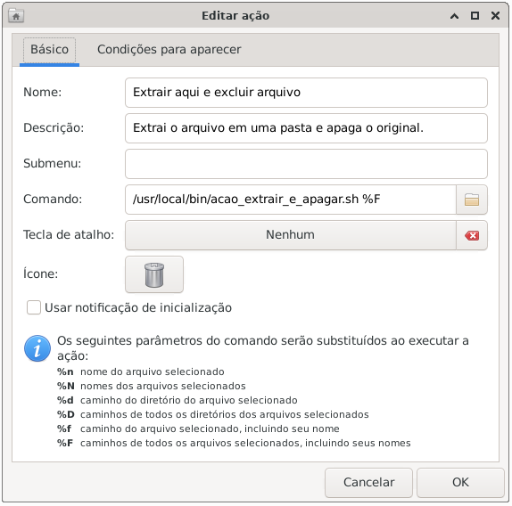
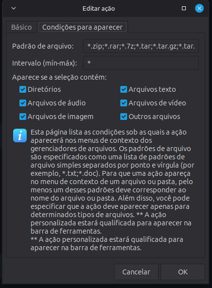

# extrair-e-apagar

Script simples para extrair arquivos compactados dentro de uma pasta com o mesmo nome do arquivo e, após a extração bem-sucedida, **apagar o arquivo original compactado**.  
Ideal para quem quer evitar duplicar espaço entre o `.zip` e os arquivos extraídos.

Compatível com:
zip, rar, 7z, tar, tar.gz, tar.xz, tar.bz2, tgz, tbz2, bz2, gz, Z, lz4, lzma, xz, zst, tar.zst, cab, iso.

---

## 🧰 Instalação

1. Baixe o script ou clone o repositório:
   ```bash
   git clone git@github.com:jonas854/extrair-e-apagar.git
   cd extrair-e-apagar
   ```

2. Dê permissão de execução:

   ```bash
   chmod +x extrair_e_apagar.sh
   ```

3. Mova o script para um diretório da sua preferencia: <br>
    Ex: /usr/local/bin/

   ```bash
   sudo mv -i extrair_e_apagar.sh /usr/local/bin/
   ```

## 🧩 Integração com o Thunar (XFCE)
Você pode integrar o script diretamente ao menu de contexto do Thunar (clicar com o botão direito > "Extrair e apagar").

1️⃣ Abra as ações personalizadas do Thunar

No Thunar, clique em Editar → Configurar ações personalizadas...

Clique em + para adicionar uma nova ação.

2️⃣ Preencha os campos:

Nome: Extrair e apagar

Descrição: Extrai o arquivo em uma pasta e apaga o original

Comando:

   ```bash
/usr/local/bin/acao_extrair_e_apagar.sh %F
   ```

3️⃣ Defina os tipos de arquivo

Na aba Condições de aparência, marque:

“Arquivos”

E adicione os padrões:
   ```bash
*.zip;*.rar;*.7z;*.tar;*.tar.gz;*.tar.xz;*.tar.bz2;*.tgz;*.tbz2;*.bz2;*.gz;*.Z;*.lz4;*.lzma;*.xz;*.zst;*.tar.zst;*.cab;*.iso
   ```

Clique em OK para salvar.

ou


nano ~/.config/Thunar/uca.xml

<action>
	<icon>user-trash</icon>
	<name>Extrair e apagar</name>
	<submenu></submenu>
	<unique-id>1761930341351381-1</unique-id>
	<command>/usr/local/bin/acao_extrair_e_apagar.sh %F</command>
	<description>Extrai o arquivo em uma pasta e apaga o original.</description>
	<range>*</range>
	<patterns>*.zip;*.rar;*.7z;*.tar;*.tar.gz;*.tar.xz;*.tar.bz2;*.tgz;*.tbz2;*.bz2;*.gz;*.Z;*.lz4;*.lzma;*.xz;*.zst;*.tar.zst;*.cab;*.iso</patterns>
	<other-files/>
</action>


## 🖼️ Exemplos de configuração no Thunar

Abaixo estão exemplos de como configurar as ações personalizadas no Thunar para usar o script:





4️⃣ Teste

Agora, no Thunar:

Clique com o botão direito em um arquivo .zip (ou outro compatível)

Escolha Ações personalizadas → Extrair e apagar


💬 Créditos

Criado por Jonas S. <br>
Colaboração: Fernando Souza (https://github.com/tuxslack)
